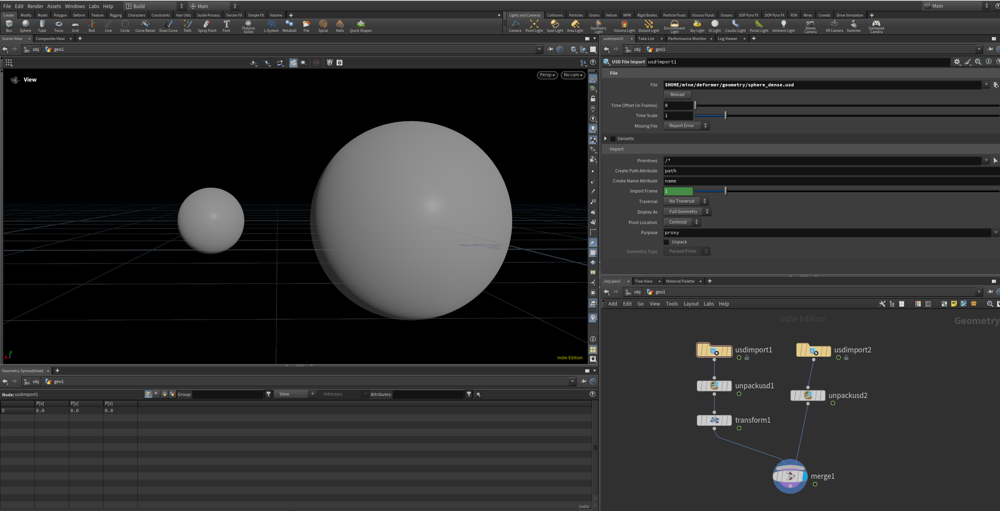
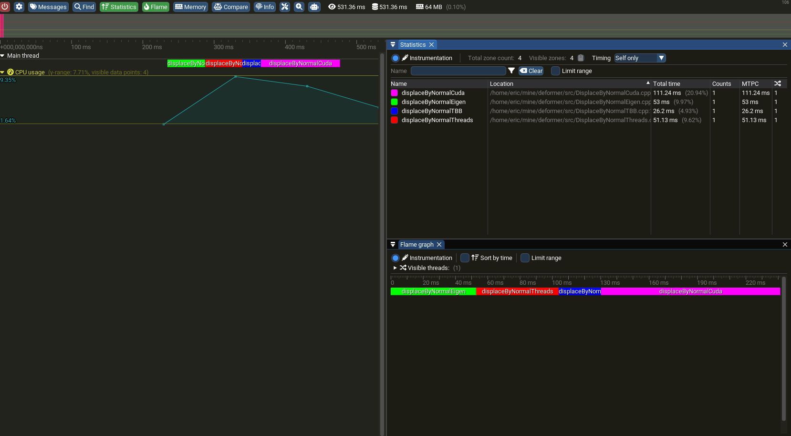

# Re-implementing the "peak" of Houdini's Peak node.

This dummy project aims to compare various implementations of the "peaking" functionality of the Houdini Peak node. This problem was chosen because of its simplicity, so that I focus on learning C++ and the various frameworks listed in the following:
- USD
- Eigen
- oneTBB
- CUDA
- Tracy profiling

The various implementations methods are as follows:
- Eigen - Single-threaded and relying on SIMD to vectorise matrix computations.
- Threading - Use `std::thread` to split the processing of each face equally amongst pre-allocated threads with threadcount constant based on how many cores are on the system.
- oneTBB - Use a thread pool instead, with the pool size chosen (smartly) by TBB, and with thread stealing.
- CUDA - Chuck to the GPU and run the operations in a kernel. Let each cuda thread in a threadblock handle one face.

Each method is then profiled with Tracy instrumented code to analyze performance.



# Results

There were roughly ~2mil points being displaced. Application was compiled with standard cmake release mode optimisations.



### Performance Summary

| Implementation | Total Time (ms) | Relative to Fastest |
|---------------|----------------|------------|
| TBB | 26.20 ms | 1.00x |
| std::thread | 51.12 ms | 1.95x |
| Eigen | 53.00 ms | 2.02x |
| CUDA | 111.24 ms | 4.25x |

- With low point count, single-thread Eigen will win out because the other methods involve waaay higher overhead of scheduling threads or moving stuff from/to the GPU.
- TBB does some smart scheduling of tasks into threads, which unsurprisingly performs better than my naive `std::thread` implementation that just equally allocates.
- GPU results were surprisingly slow. More fine-grained profiling showed that overhead of alloc + transfer of host-device data dominates majority of runtime (96%). I used RTX5070Ti for CUDA benchmarking, but note also I compiled for compute_90 which is not its latest support version.

# Getting Started and Building the Code

Clone with:
```bash
git clone --recursive
```

Project has the following dependencies:
- Eigen
- oneTBB
- CUDA Toolkit

Install with:
```bash
sudo apt-get install libeigen3-dev libtbb-dev nvidia-cuda-toolkit
```

This project also depends on USD, which you'll need to build yourself.

Minimally built USD (v25.08) with following options:
```bash
python build_scripts/build_usd.py \
      --no-python \
      --no-imaging \
      --no-materialx \
      --no-tools \
      --no-examples \
      --no-tutorials \
      --no-tests \
      --no-docs \
      --no-python-docs \
      --no-usdview \
      --no-alembic \
      --no-draco \
      --no-openimageio \
      --no-opencolorio \
      --no-embree \
      --no-openvdb \
      --no-vulkan \
      --build-monolithic \
      --build-variant release
```
Check out the official [OpenUSD](https://github.com/PixarAnimationStudios/OpenUSD) repository for building instructions.


This project uses CMakePresets to run. You'll need to inherit one of the presets and specify the path to your USD build. You may also override the build directory with the `"binaryDir"` key. Provided is a minimal CMakeUserPresets.json template.
```json
{
    "version": 8,
    "configurePresets": [
        {
            "name": "release",
            "inherits": "release-profile-base",
            "cacheVariables": {
                "CMAKE_PREFIX_PATH": "/path/to/your/usd/build"
            }
        }
    ],
    "buildPresets": [
        {
            "name": "release",
            "configurePreset": "release"
        }
    ]
}
```
Which you can run with:
```bash
cmake --preset release && cmake --build --preset release && ./build/release/deformer
```
By default the release-profile-base will leave the program hanging before exit, waiting for a tracy session to be connected.


If you wish to see the profiling results, you'll also need to build the tracy profiler:
```bash
$(cmake -Ssubmodules/tracy/profiler -Bbuild/tracy-profiler -DLEGACY=ON && make -Cbuild/tracy-profiler)
```

Which you can run with
```bash
./build/tracy-profiler/tracy-profiler
```
to connect to the session.


# TODO
- Write a python build script
- Profile CUDA on GPU with nvidia nsight `nsys`
- Add openCL implementation + profiling on GPU